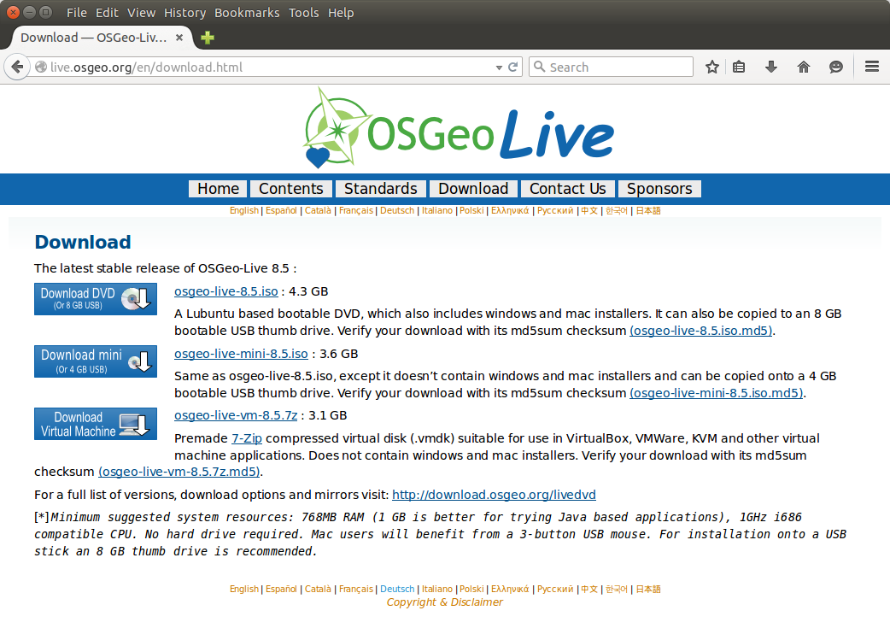

# Workshop Installation

The workshop can be installed in [OSGeo Live](http://live.osgeo.org) either running from USB Stick or as a virtual machine in VirtualBox.
If you're Ubuntu user you can install the workshop package right away, but it's possible to run it in VirtualBox as well.

For better performance and the ability to save the current state of the workshop, runining [OSGeo Live](http://live.osgeo.org) in VirtualBox is recommended.

## Download Software 

First you need to download and install the following Software:

1. [VirtualBox](https://www.virtualbox.org/wiki/Downloads)

    

2. [7-Zip](http://www.7-zip.org/download.html)

    

## Setup OSGeo Live!

Next you need to [download the OSGeo Live! image](http://live.osgeo.org/en/download.html) for VirtualBox. 



The downloaded file then needs to be uncompressed using 7-Zip. After that you will have a virtual image named `osgeo-live-8.5.vmdk`, which will be about 10.7GB large.

Once you have the image file ready, you can load it in VirtualBox following the official setup guide: http://live.osgeo.org/en/quickstart/virtualization_quickstart.html

## Install pgRouting

When you have OSGeo Live! up and running, you can install the pgRouting workshop from within OSGeo Live!:

1. Download the [Workshop Ubuntu Package](https://launchpad.net/~georepublic/+archive/ubuntu/pgrouting/+files/pgrouting-workshop_2.0.6-ppa1_all.deb) into the `Downloads` directory.
2. Install the package with double-click using Ubuntu Software Center, or open a `Applications ‣ Accessories ‣ Terminal` window and type

```
cd ~/Downloads
sudo dpkg -i pgrouting-workshop_2.0.6-ppa1_all.deb
```

Note: password as well as user name is `user`.

To have easy access to the workshop files and data, create a symbolic link like this:

```
cp -R /usr/share/pgrouting/workshop ~/Desktop/pgrouting-workshop
sudo ln -s ~/Desktop/pgrouting-workshop /var/www/html/pgrouting-workshop
```

You can then find all workshop files in the `pgrouting-workshop` folder and have access to the files through the browser as well:

* Web directory: http://localhost/pgrouting-workshop/web/
* Online manual: http://localhost/pgrouting-workshop/docs/html/

## Used Software

The workshop makes use of the following software, installed on OSGeo Live!. 

* Terminal
* pgAdmin3
* QGIS
* Geoserver

You will also need a text editor to modify HTML/Javascript.
